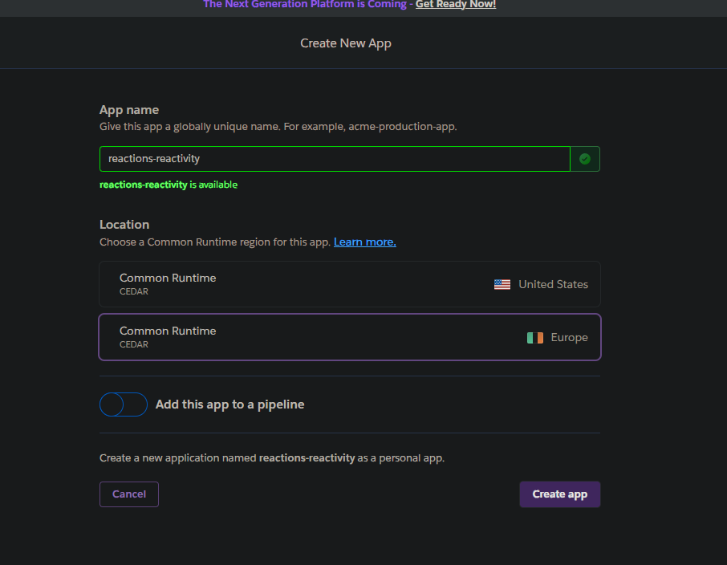
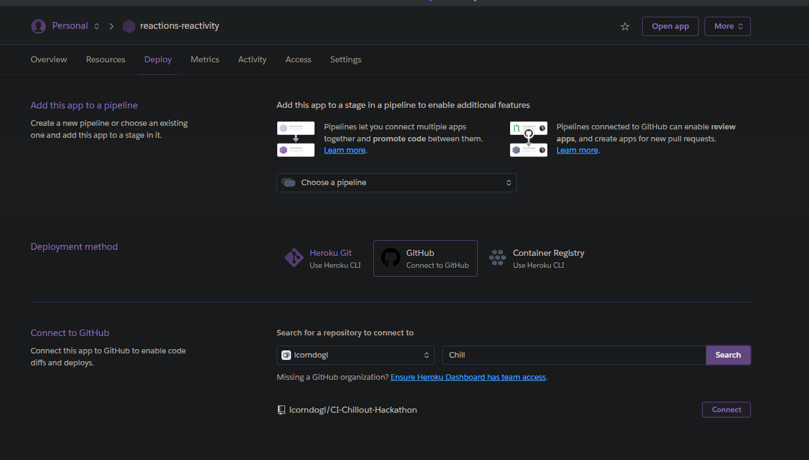
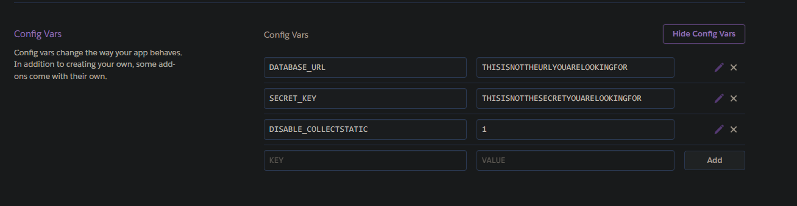
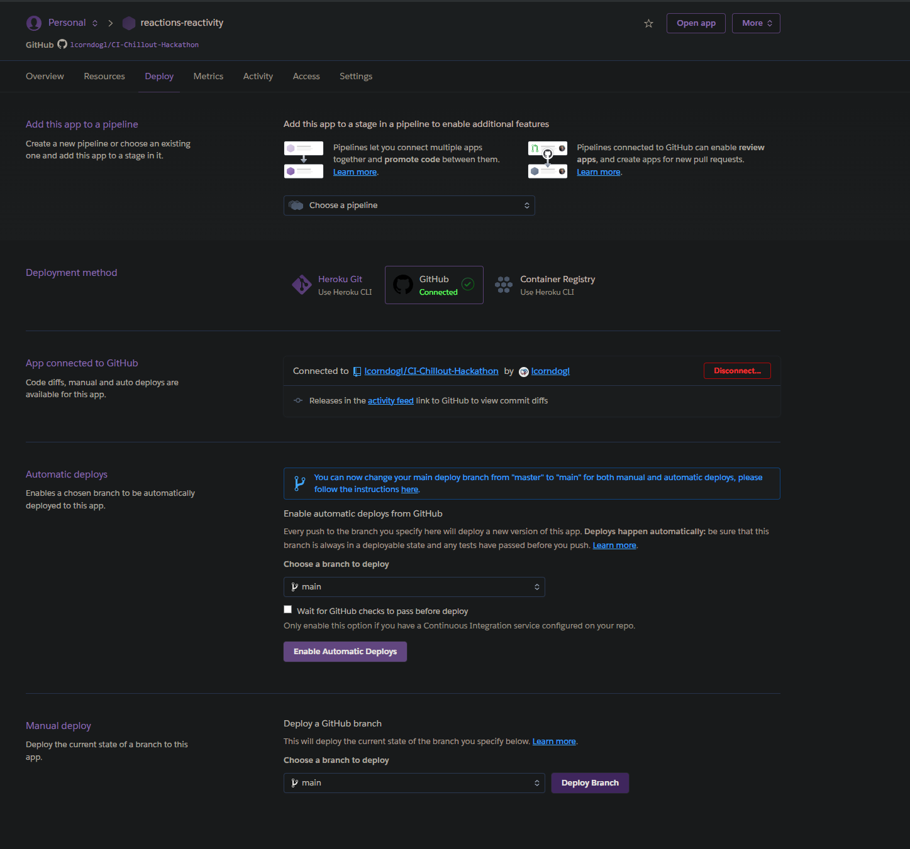
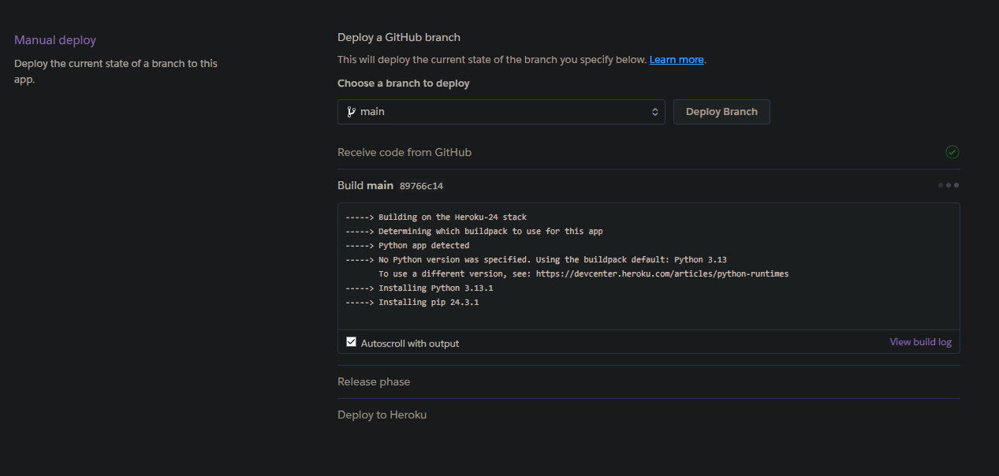
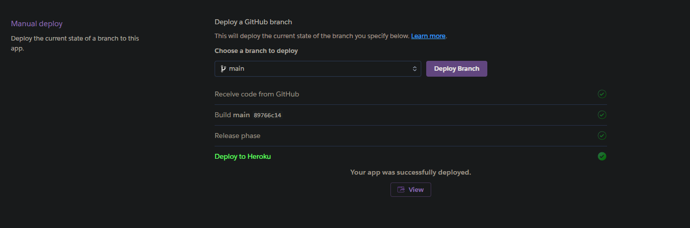
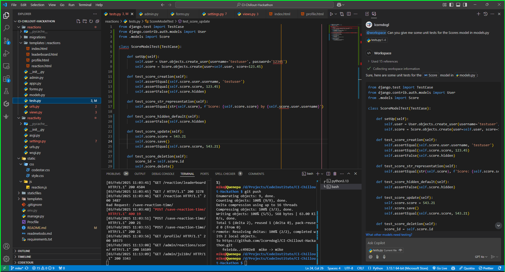
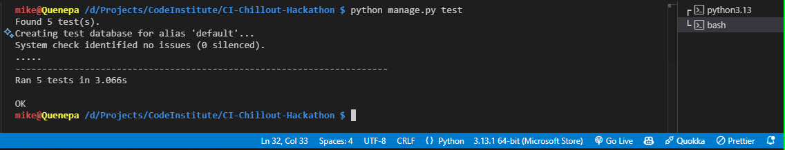

# Reaction Speed Test

## Contents
- [Introduction](#introduction)
- [User Experience](#user-experience)
  - [Stories](#stories)
- [Project Setup](#project-setup)
- [AI Influence](#ai-influence)
- [Entity Relationship Diagram](#entity-relationship-diagram)
- [Bugs](#bugs)
  - [Known Bugs](#known-bugs)
  - [Fixed Bugs](#fixed-bugs)
- [Future Features](#future-features)
  - [Feature 1](#feature-1)
  - [Feature 2](#feature-2)
- [Deployment](#deployment)
- [Technologies Used](#technologies-used)
- [Testing](#testing)
  - [Creating the Tests](#creating-the-tests)
  - [Running the Tests](#running-the-tests)
- [Credits](#credits)
  - [Code Institute](#code-institute)
- [Video Game Tracker Project](#video-game-tracker-project)
  - [CSS](#css)

## Introduction

This is a project to allow users to create an account so they can track what their reaction time is. This is automatically added to a leaderboard so they can be compared against different users.

###### [*Back to contents*](#contents)

## User Experience

###### [*Back to contents*](#contents)

### Stories

###### [*Back to contents*](#contents)

- As a user I want to be able to test what my reaction time is
- As a user I want to be able to see how my reaction compares to other users
- As a user I want to be able to hide my results from other users
- As a user I want to be able to remove my results.

## Project Setup

To help speed up the setup of the project, I made a few lines of code that could be run in the terminal to create all of the basic files to form a basis for the project:

```command line
pip install Django~=4.2.1
pip3 install dj-database-url~=0.5 psycopg2
pip3 install gunicorn~=20.1
pip3 freeze --local > requirements.txt
django-admin startproject reactivity .
echo "web: gunicorn reactivity.wsgi" > Procfile
echo 'import os
os.environ["DATABASE_URL"]=""
os.environ["SECRET_KEY"]=""
os.environ["DEBUG"]=1' > env.py
echo "
env.py" >> .gitignore
python3 manage.py migrate
python3 manage.py runserver
```

This allowed me to have only a few additional lines that I had to run to create the project. These tasks were:

- Adjust the allowed hosts
- Set CSRF_TRUSTER_ORIGINS
- Run the startapp command
- Add the app to the INSTALLED_APPS
- Create Database on CI Database Maker
- Deploy to Heroku (Steps later in the readme)

## AI Influence

Due to time constraints I have relied more on copilot than I usually would, whilst this has been an overall positive there have been some negatives due to CoPilot not fully understanding the structure of the project.

## Entity Relationship Diagram

USER
+-----------------+
| id (PK)         |
| username        |
| password        |
| email           |
| date_joined     |
+-----------------+
        |
        |
        | 1
        |
        | has
        |
        | *
+-----------------+
| SCORE           |
+-----------------+
| id (PK)         |
| score           |
| created_on      |
| updated_on      |
| hidden          |
| user_id (FK)    |
+-----------------+

## Bugs

### Reaction time is artificially incremented

Suspectedly due to the DOM manipulations the time that is recorded is ~100~200ms higher than what it actually is.

### Troubleshoot

After adding the profiles section to the project, updating the navbar to reflect this was a bit of a problem, this turned out to be a combination of using CoPilot and not using the correct base.html file, as Copilot was suggesting to edit the base.html file that was located within the django allauth folder, rather than the one that was directly in the templates directory.

## Future Features

### Update Game JavaScript

In an attempt to fix the time recorded being slower than what it is in reality, I plan to adjust the game to add additional time checks before and after DOM manipulations, as well as including the event listener within the same function itself rather than in one of the functions that it goes through - to try and reduce the amount of code that is run through before the time of the user click is created.

### Profile Pages

In future I would like to create a profile page for each user, showing the number of tests they have completed, their best result, worst result as well as an average.

## Deployment

1) Add the required files to the git repository with the command `git add .`

2) Commit the changes to the repository with the command commit command `git commit -m "Final project commit"`

3) [Create new app on Heroku](https://dashboard.heroku.com/new-app)



4) Connect to GitHub repo



5) Set Config vars to replicate what is in env.py - heroku-config-vars.png
link to github



6) Manual deploy on heroku - heroku-deploy.png



7) Wait for deployment to finish



8) Check project deployed as expected



###### [*Back to contents*](#contents)

## Technologies Used

###### [*Back to contents*](#contents)

### HTML Language

HTML is used as the base to the project, utilising [*Django*](#django) to piece the files together to dynamically serve the webpages to the user depending on if they are loggined in or not, as well as the actions they are performing.

###### [*Back to contents*](#contents)

### CSS Styling

CSS is used to provide style to the website to make it more visually appealing to the user of the website. Utilising [*Bootstrap*](#bootstrap) as part of the CSS Styling.

###### [*Back to contents*](#contents)

### bash terminal

Bash  was used as the terminal of choice, using it for various things from setting alias' for commonly used commands, creating directories and files, as well as interfacing with git to add, commit and push to [*GitHub*](#github).

###### [*Back to contents*](#contents)

### Bootstrap

Boostrap was used to provide a template for numerous IDs and classes for the formatting of the project.

###### [*Back to contents*](#contents)

### Django

Django framework has been used to dynamically load views and models via Django Template Language (DTL) based on if a user is logged in or not, as well as adding/removing entries from a database in a secure way and protecting from malicious attacks via backend server processing

###### [*Back to contents*](#contents)

### Git

Git has been used to allow for easy versioning of the project, as well as tracking changes which may become important for troubleshooting if any errors are introduced as the code is developed

### GitHub

GitHub has been used as a central repository where the code can be accessed online. It has also been linked to heroku allowing heroku to fetch the repository from GitHub to deploy the project into an online environment, as well as testing the project both locally and online as it is developed to ensure consistent behaviours

###### [*Back to contents*](#contents)

### Heroku

Heroku has been used to provide the back end processing of the project, allowing it to run Django and generate the HTML of the pages that the user is requesting dynamically

###### [*Back to contents*](#contents)

### Postgres

Data has been stored within a Postgres database that has been provided by [*CodeInstitute*](#code-institute).

###### [*Back to contents*](#contents)

### Visual Studio Code

Visual Studio Code has been used to create the project as a pseudo-IDE, allowing for the use of emmet commands to help create the code in an efficient manner, as well as CoPilot integration

###### [*Back to contents*](#contents)

### CoPilot

CoPilot has been used as the AI tool in this project, utilising it for both helping with code creation such as pulling bootstrap templates into the code rather than using a search engine and the documentation where possible. It has also been used to help troubleshoot any errors within the code, and helping with getting the layout of the project correct in places where I may have struggled without it.

###### [*Back to contents*](#contents)

## Testing

### AI Testing

#### Creating the Tests



#### Running the tests



## Credits

### Code Institute

#### Codestar blog CSS

[Using the codestar blog css as a template to go off](static/css/codestar.css)

#### Queuing up & Displaying messages

The code used to store and return immediate user feedback from the Code Institute codestar blog has been utilised to alter users when certain tasks have been triggered.

## Video Game Tracker Project

### CSS

[Borrowing the CSS from my Video Game Tracker Project for styling](static/css/style.css)