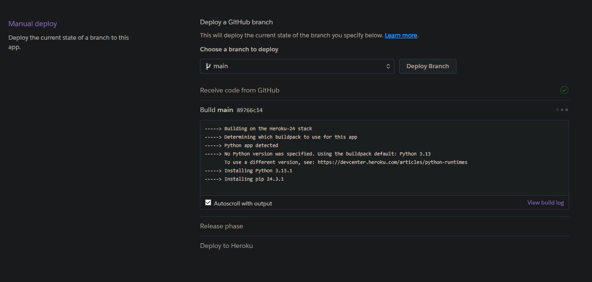
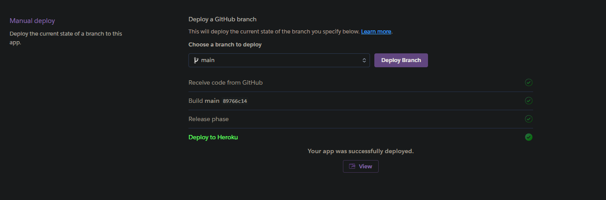

create new heroku app: <https://dashboard.heroku.com/new-app>

Link to github repo 

set config vars: <https://dashboard.heroku.com/apps/reactions-reactivity/settings>

hit deploy 

wait for deployment to finish 

Deployment success 
